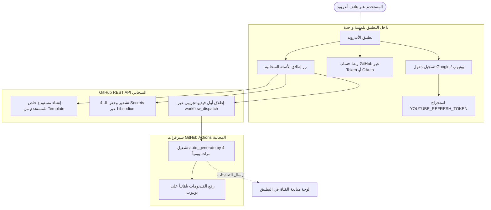

# 📱 الدليل الشامل وخطة العمل: تحويل مولد ريلز القرآن الكريم إلى تطبيق أندرويد متكامل
## (Quran Reels Generator - Android Mobile Orchestrator)

> **نية العمل:** صدقة جارية لوجه الله تعالى 🌿  
> **الهدف:** تمكين مستخدمي الهواتف الذكية من إطلاق وإدارة قنوات يوتيوب للقرآن الكريم مؤتمتة 24/7 بضغطة زر واحدة بدون الحاجة لجهاز حاسوب أو كتابة أي كود برمجي.

---

## 📑 فهرس المحتويات
1. [الرؤية والهدف الاستراتيجي](#1-الرؤية-والهدف-الاستراتيجي)
2. [التحليل التقني للمشروع المفتوح المصدر الحالي](#2-التحليل-التقني-للمشروع-المفتوح-المصدر-الحالي)
3. [تحليل التحديات الحالية لمستخدمي الهواتف](#3-تحليل-التحديات-الحالية-لمستخدمي-الهواتف)
4. [الهيكلية المعمارية لتطبيق الأندرويد (The Mobile Cloud Orchestrator)](#4-الهيكلية-المعمارية-لتطبيق-الأندرويد)
5. [مخطط الواجهات وتجربة المستخدم (UI/UX Journey)](#5-مخطط-الواجهات-وتجربة-المستخدم)
6. [الهندسة البرمجية وتكامل الـ APIs](#6-الهندسة-البرمجية-وتكامل-الـ-apis)
7. [التقنيات والمكتبات المستخدمة](#7-التقنيات-والمكتبات-المستخدمة)
8. [خطة العمل التنفيذية للغد (Step-by-Step Action Plan)](#8-خطة-العمل-التنفيذية-للغد)

---

## 1. الرؤية والهدف الاستراتيجي

المشروع الحالي نجح بامتياز في تحقيق معادلة صعبة: **إنتاج فيديوهات ريلز قرآنية عالية الجودة، خالية من أي وجوه أو عناصر غير لائقة (طبيعة نقية 100%)، وتعمل تلقائياً 4 مرات يومياً عبر سيرفرات GitHub Actions مجاناً بالكامل مدى الحياة.**

لكن معظم جمهور المحتوى في الوطن العربي والعالم الإسلامي يستخدمون **الهواتف الذكية (Android)**، ولا يمتلكون حواسيب مكتبية لتثبيت Python، تشغيل الطرفية (Terminal)، أو التعامل مع إعدادات التشفير المعقدة.

**الحل:** إنشاء تطبيق أندرويد أنيق وسريع، يعمل كـ **"لوحة تحكم ومنسق أتمتة سحابي"**، يربط حساب يوتيوب وحساب GitHub بضغطة زر، وينشئ القناة المؤتمتة في أقل من دقيقتين.

---

## 2. التحليل التقني للمشروع المفتوح المصدر الحالي

يتكون المشروع في حالته الراهنة من المكونات الأساسية التالية:

### أ. محرك المونتاج والتوليد (`auto_generate.py`)
- **جلب النصوص القرآنية:** الاتصال بـ `api.alquran.cloud` لجلب النص بالرسم العثماني المشكول مع أرقام الآيات.
- **جلب الصوتيات وقص الصمت:** استخدام `everyayah.com` لدعم 14 قارئاً عالمياً، مع استبعاد فترات الصمت من بداية ونهاية التسجيل عبر مكتبة `pydub`.
- **معالجة الفيديو وخلفيات الطبيعة:**
  - فلتر صارم جداً للكلمات المحظورة لمنع ظهور أي بشر أو وجوه من موقع Pexels.
  - مولد محلي ذكي (Failsafe Generator) يعتمد على `NumPy` لتوليد سماء ليلية وشفق قطبي متحرك في حال انقطاع اتصال Pexels لضمان عدم توقف النشر أبداً.
- **معالجة الخط العربي:** تشكيل الحروف وعكس الاتجاه عبر `arabic_reshaper` و `bidi.algorithm` باستخدام خط مصحفي مخصص (`Amiri` / `Dubai`).
- **تصدير الفيديو:** ضبط المقاسات لشاشات الموبايل الرأسية (1080x1920 بمعدل 24 إطار/ثانية) عبر `moviepy`.

### ب. محرك الرفع والربط (`youtube_uploader.py` & `setup_youtube.py`)
- يستخدم مكتبات Google الرسمية للمصادقة عبر OAuth 2.0.
- يستخرج المفاتيح الثلاثة الحاسمة:
  1. `YOUTUBE_CLIENT_ID`
  2. `YOUTUBE_CLIENT_SECRET`
  3. `YOUTUBE_REFRESH_TOKEN` (للسماح للسيرفر بالرفع المستمر دون طلب تسجيل دخول جديد).

### ج. سيرفر الأتمتة المجدول (`daily_quran_reel.yml`)
- يعمل عبر **GitHub Actions** على سيرفرات Ubuntu الافتراضية.
- مجدول للتشغيل 4 مرات يومياً:
  - `00:22 UTC` (ثلث الليل المتأخر)
  - `05:41 UTC` (الصباح والضحى)
  - `11:33 UTC` (الظهيرة)
  - `17:19 UTC` (المساء وذروة التفاعل)
- يقوم بحفظ حالة الآيات في `state.json` وتحديث المستودع تلقائياً لتجنب تكرار الآيات.

---

## 3. تحليل التحديات الحالية لمستخدمي الهواتف

| التحدي للمستخدم العادي | سببه في المشروع الحالي | حل تطبيق الأندرويد البديل |
| :--- | :--- | :--- |
| **غياب بيئة التشغيل** | يحتاج Python 3.10 و FFmpeg و Git | لا يحتاج أي بيئة، التطبيق مجرد APK خفيف يثبته المستخدم |
| **استخراج التوكن** | سكربت `setup_youtube.py` يفتح خادم محلي على منفذ 8080 في الحاسوب | تسجيل دخول عبر Google OAuth داخل التطبيق مباشرة في 10 ثوانٍ |
| **حقن الأسرار في GitHub** | إدخال 4 مفاتيح مشفرة يدوياً في إعدادات المستودع عبر متصفح الجوال | التطبيق يشفر الأسرار ويحقنها عبر GitHub REST API بضغطة زر واحدة |
| **إنشاء المستودع** | يتطلب Fork أو Clone ورفع يدوي | التطبيق ينشئ المستودع للمستخدم عبر GitHub Template API فوراً |
| **مراقبة القناة** | الدخول لصفحة GitHub Actions لفحص السجلات | شاشة Dashboard داخل التطبيق تعرض حالة النشر والإحصائيات وإشعارات هاتفية |

---

## 4. الهيكلية المعمارية لتطبيق الأندرويد

### لماذا لا نقوم برندر الفيديو على الهاتف محلياً طوال اليوم؟
1. نظام أندرويد يقتل العمليات في الخلفية (Doze Mode & Battery Management) لتقليل استهلاك البطارية.
2. معالجة الفيديو بالـ FFmpeg 4 مرات يومياً تستهلك طاقة الهاتف، تسخن المعالج، وتستهلك باقة البيانات.
3. **الحل العبقري المبتكر:** **GitHub Actions كـ Backend سحابي مجاني 100%، وتطبيق الأندرويد كـ Frontend ذكي للتحكم والإعداد والمراقبة.**



---

## 5. مخطط الواجهات وتجربة المستخدم (UI/UX Journey)

### 🎨 الهوية البصرية (Theme)
- **الخلفيات:** أسود ملكي فاحم وكحلي عميق (`#0A0A12`, `#12121D`).
- **اللمسات والخطوط:** ذهبي إسلامي راقٍ وتدرجات (`#D4AF37`, `#F4D06F`).
- **الخطوط:** خط القاهرة (`Cairo`) للعناوين وخط أميري (`Amiri`) للآيات والروحانية.

### 📱 الشاشات الرئيسية الأربع:
1. **شاشة البداية والترحيب (Onboarding):**
   - شرح فكرة الصدقة الجارية والنشر التلقائي 24/7.
   - مميزات المشروع وأمان المفاتيح (مفاتيحك مشفرة ولا تخرج من حسابك الشخصي).
2. **معالج الربط السريع (Setup Wizard):**
   - **الخطوة الأولى:** زر تسجيل الدخول بقناة يوتيوب -> الموافقة على الصلاحية -> جلب الـ Refresh Token تلقائياً.
   - **الخطوة الثانية:** إدخال مفتاح GitHub Personal Access Token (مع توفير زر وشرح مبسط لتوليده في 30 ثانية مع صلاحيات `repo` و `workflow`).
   - **الخطوة الثالثة (اختياري):** إدخال مفتاح Pexels لخلفيات الطبيعة (مع توفير مفتاح افتراضي أو خيار التوليد التلقائي للنجوم والشفق).
3. **زر الإطلاق السحري (One-Click Launch):**
   - شريط تقدم متحرك (Progress Bar) يوضح الخطوات في ثوانٍ:
     - 🔄 إنشاء المستودع في حسابك...
     - 🔒 تشفير وحفظ بيانات الاعتماد بأمان...
     - ⚙️ تفعيل مهام النشر اليومية (4 مرات يومياً)...
     - 🚀 تجربة رفع أول فيديو الآن...
4. **لوحة التحكم والمتابعة (Dashboard):**
   - مؤشر حالة الأتمتة: 🟢 **نشط ويعمل تلقائياً**.
   - موعد الفيديو القادم (عد تنازلي).
   - بطاقات آخر الفيديوهات المنشورة مع زر للمشاهدة على يوتيوب.
   - زر يدوي سريع: **"⚡ إنشاء ونشر ريل إضافي الآن"**.
   - سجل العمليات (Logs Viewer) بلغة عربية مفهومة.

---

## 6. الهندسة البرمجية وتكامل الـ APIs

### أ. تشفير وحقن أسرار GitHub (GitHub Actions Secrets API)
تتطلب واجهة GitHub تشفير الأسرار قبل إرسالها باستخدام المفتاح العام للمستودع وخوارزمية `libsodium` (Sealed Box):
1. طلب المفتاح العام:
   ```http
   GET https://api.github.com/repos/{owner}/{repo}/actions/secrets/public-key
   ```
   يعود بـ `key_id` و `key` (مفتاح بصيغة Base64).
2. تشفير القيمة محلياً في التطبيق:
   باستخدام مكتبة `libsodium` / `pinenacl`:
   `encrypted_bytes = crypto_box_seal(secret_value, public_key)`
3. إرسال السر المشفر:
   ```http
   PUT https://api.github.com/repos/{owner}/{repo}/actions/secrets/{SECRET_NAME}
   Body: { "encrypted_value": base64(encrypted_bytes), "key_id": key_id }
   ```
   *يتم تكرار هذه الخطوة للأسرار الأربعة تلقائياً دون أي تدخل بشري!*

### ب. إنشاء المستودع بضغطة زر (Repository Template API)
بدلاً من رفع مئات الملفات يدوياً، نجعل المستودع الرئيسي **Template Repository**، ونستدعي:
```http
POST https://api.github.com/repos/{template_owner}/Quran-Reels-Generator/generate
Body: { "name": "Quran-Reels-Auto", "private": true }
```
فيقوم GitHub بنسخ كامل الكود وملفات المونتاج وسيرفر الـ Actions لحساب المستخدم في ثانية واحدة!

### ج. إطلاق وتتبع سير العمل (Workflow Dispatch & Runs)
- للتشغيل الفوري:
  ```http
  POST https://api.github.com/repos/{owner}/{repo}/actions/workflows/daily_quran_reel.yml/dispatches
  Body: { "ref": "main" }
  ```
- لمتابعة الحالة:
  ```http
  GET https://api.github.com/repos/{owner}/{repo}/actions/runs
  ```

---

## 7. التقنيات والمكتبات المستخدمة

- **إطار العمل:** **Flutter (Dart)** - الخيار الأول للأداء العالي، الجمالية البصرية، ودعم العربية الأصيل.
- **الحزم والمكتبات المعتمدة:**
  - `http`: للاتصال بـ GitHub REST API.
  - `flutter_appauth` أو `google_sign_in`: لمصادقة OAuth واستخراج الـ Refresh Token.
  - `flutter_sodium` أو `pinenacl`: لتشفير أسرار GitHub باستخدام Libsodium SealedBox.
  - `provider` أو `riverpod`: لإدارة الحالة والانتقال بين الشاشات بسلاسة.
  - `shared_preferences` / `flutter_secure_storage`: لتخزين المفاتيح محلياً بأمان فائق.
  - `url_launcher`: لفتح روابط يوتيوب ومستندات الإعداد بنقرة واحدة.

---

## 8. خطة العمل التنفيذية للغد (Step-by-Step Action Plan)

سنقوم غداً بتقسيم العمل إلى 5 مراحل متتالية وواضحة:

### المرحلة 1: إعداد البيئة ومستودع القالب (Template Setup)
- [ ] التأكد من تهيئة مستودع GitHub الحالي كمستودع نموذج (Template Repository).
- [ ] إنشاء هيكل مشروع تطبيق الأندرويد (Flutter Project Skeleton).

### المرحلة 2: تصميم وبناء الواجهات الإسلامية الفاخرة (UI Layer)
- [ ] بناء نسق الألوان الملكي (Dark Gold Theme) وإعداد الخطوط العربية (`Cairo` & `Amiri`).
- [ ] تصميم شاشة الترحيب والشرح (Onboarding).
- [ ] تصميم شاشة معالج الإعداد التفاعلي (3-Step Setup Wizard).
- [ ] تصميم شاشة لوحة التحكم والمتابعة (Dashboard & Controls).

### المرحلة 3: محرك الربط مع Google ويوتيوب (YouTube Auth Engine)
- [ ] دمج تدفق Google OAuth2 Mobile Flow.
- [ ] استخراج وحفظ `YOUTUBE_CLIENT_ID` و `YOUTUBE_CLIENT_SECRET` و `YOUTUBE_REFRESH_TOKEN`.

### المرحلة 4: محرك GitHub السحري والتشفير (GitHub Automation Engine)
- [ ] برمجة دوال الاتصال بـ GitHub REST API.
- [ ] تضمين خوارزمية تشفير `libsodium` للـ Secrets وحقنها تلقائياً.
- [ ] دمج وظيفة إنشاء المستودع من الـ Template وتشغيل أول Workflow.

### المرحلة 5: التجربة الشاملة وإخراج ملف الـ APK النهائي (Testing & APK Build)
- [ ] إجراء تجربة كاملة End-to-End: ربط حساب جديد -> فحص ظهور المستودع في GitHub -> التأكد من حقن المفاتيح -> مراقبة تشغيل الفيديو ورفعه لايف على يوتيوب.
- [ ] تجميع وبناء ملف التطبيق النهائي (`app-release.apk`).
- [ ] كتابة دليل استخدام ونقاط لشرح التطبيق في الفيديو القادم على يوتيوب.

---

> 🤲 **ملاحظة ختامية:** هذا الملف محفوظ كمرجع أساسي ودليل عمل معتمد في مسار المشروع، لننطلق منه مباشرة غداً في البرمجة خطوة بخطوة حتى تسليم ملف الـ APK جاهزاً للنشر بين الناس.
